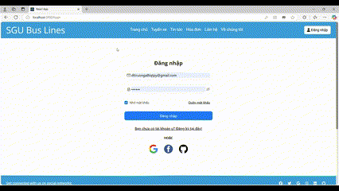

# Bus Ticket Booking Frontend

## Link to Back-end: [Click here](https://github.com/BT2701/bus-ticket-booking-backend)

## Introduction
This is the frontend system for a bus ticket booking website. It supports three types of users: admin, customer, and staff. Customers are further divided into logged-in and non-logged-in users.

## Project Members
- **3121410546**: [Duong Thanh Truong](https://github.com/BT2701)
- **3121410128**: [Pham Van Du](https://github.com/vandu178)
- **3121410149**: [Pham Tan Dat](https://github.com/phamtandat655)
- **3121410542**: [Nguyen Nhat Truong](https://github.com/nhattruong16062003)

## Features
- User roles: admin, customer, staff
- User authentication via Google, Facebook, and GitHub
- Integration with VNPay for payment processing
- Professional ticket booking system:
    - **Customer**:
        - Browse available bus routes and schedules
        - Book tickets online
        - View booking history
        - Cancel bookings
        - Receive booking confirmation via email
    - **Staff**:
        - Manage bus schedules
        - Assist customers with bookings and cancellations
        - Handle customer inquiries and support
    - **Admin**:
        - Manage user roles and permissions
### Demo
#### Customer
<table width:100>
    <tr>
        <td></td>
        <td></td>
    </tr>
    <tr>
        <td></td>
        <td></td>
    </tr>
    <tr>
        <td></td>
        <td></td>
    </tr>
    <tr>
        <td></td>
        <td></td>        
    </tr>
    <tr>
        <td></td>
        <td></td>
    </tr>
    <tr>
        <td></td>
        <td></td>
    </tr>
    <tr>
        <td></td>
        <td></td>
    </tr>
        
</table>

#### Staff
<table width:100>
        <tr>
            <td></td>
            <td></td>
        </tr>
        <tr>
            <td></td>
            <td></td>
        </tr>
        <tr>
            <td></td>
            <td></td>
        </tr>
        <tr>
            <td></td>
            <td></td>        
        </tr> 
</table>

## Architecture
The frontend is built using React with function components, hooks, and Context API. It follows a component-based architecture to ensure modularity and reusability.

## Technologies Used

The frontend application leverages a variety of modern web technologies to deliver a seamless user experience:

- **React.js**: A powerful JavaScript library for building user interfaces, enabling the creation of dynamic and responsive components.
- **Material UI**: A popular React UI framework that provides a set of customizable and accessible components, following Google's Material Design guidelines.
- **Bootstrap**: A widely-used CSS framework that ensures responsive design and cross-browser compatibility with a collection of pre-styled components and utilities.
- **CSS**: Custom styles are applied using CSS to enhance the visual appearance and user experience of the application.


## Installation
1. Clone the repository:
    ```bash
    git clone https://github.com/BT2701/bus-ticket-booking-frontend.git
    ```
2. Navigate to the project directory:
    ```bash
    cd bus-ticket-booking-frontend
    ```
3. Install dependencies:
    ```bash
    npm install
    ```

## Usage
1. Start the development server:
    ```bash
    npm start
    ```
2. Open your browser and navigate to `http://localhost:3000`.

## Contributing
Contributions are welcome! Please fork the repository and create a pull request with your changes.

## License
This project is licensed under [Apache License Version 2.0](LICENSE).
